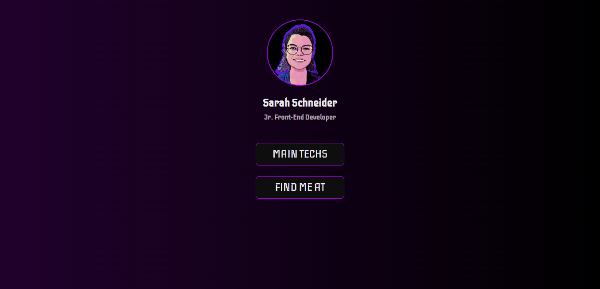

# Techs e Links

Projeto desenvolvido com o intuito de fornecer informações profissionais básicas, como as tecnologias com as quais trabalho e minhas redes sociais de desenvolvedora.

---

## Tecnologias Usadas

- HTML5
- CSS3
- CSS Flexbox
- CSS Grid
- Javascript

----

## Acesso ao Site

Para acessar o site, basta <a href="https://ssschneider.github.io/sarah-schneider/">clicar aqui</a>!

----

## Demo

| Versão Desktop: |
|----------------|
| |

| Versão Mobile: |
|---------------|
||
